# 如何运行

在你安装好所有需要的库(`pip install -r requestment.txt`)，配置好你的mongodb之后运行`python3 start.py` 来启动整个系统。
如果你是第一次运行，建议在你的mongodb的user数据库的user数据表里面插入`{'username':'root','keyword':你想设置的管理员密码}`

# 项目简介

    本人做的是学生自助学习系统，该系统包含管理员模块和学生模块，该系统旨意为学生创造更好的学习工具，在学习的过程中能自助去搜索下载相关资料，在适当的时候可以使用‘每日一言’来鼓舞用户或者使用aichat和定制的ai老师小小鑫聊聊学生或者生活中遇到的难题。

本人独立完成项目所有开发和文档操作。

## 项目需求

    对于系统管理员来讲，我设计了一套用户管理系统，运行管理员对一切用户的username和password进行更改、删除、添加、查询操作，配合图形化的界面，让所有用户状态一目了然。

    对于用户（学生）来讲，我设计了学生自助学习系统，在登录学生账号之后，有下面几个功能可供使用：

        1.   科技热点新闻实时看功能：来了解实时科技前沿资讯，点击咨询的文字自动跳转到资讯详情页面，整个过程方便快捷；

        2.   CSDN文章下载器（去除一切广告，只保留文章内容）：输入CSDN文章地址，自动下载目标文章，并保存为PDF格式，在保存为PDF步骤完成后，系统自动为用户打开PDF版的文章，方便用户浏览。

        3.   每日一言功能：点击‘每日一言’按钮即可获取今天的每日一言，点击次数不设限，可以每天看很多条。

        4.   aichat功能：和专门调试过的ai老师小小鑫进行对话，小小鑫老师会解答有关于学习或者生活中的问题。

3.2项目设计

    下图（图1）为登录的流程图，将管理员和普通用户做区分，管理员进入用户管理系统（UserManagement System）而普通用户则进入学生自助学习系统(Student Self Help
Learning System )中。

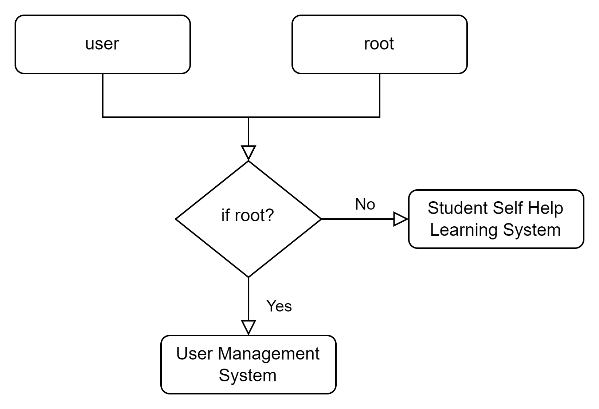

                                                        图 1 登录的流程图

    用户管理系统（User Management System）和学生自助学习系统（Student
Self Help Learning System）的类图。

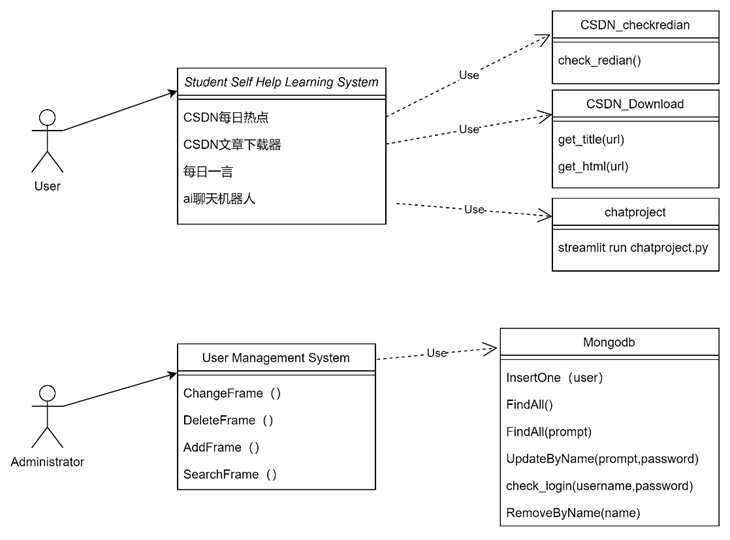

                                图 2用户管理系统和学生自助学习系统的类图

## 项目实现

1.1 整个框架

    整个框架采用tkinter图形库来构建，所有功能嵌入tkinter构建的图形界面上，本项目一共使用了三个大的图形界面包含
登录页面、用户管理系统页面和学生自助学习系统页面，还有三个的小界面，一个是下载完CSDN文章之后自动打开系统默认的PDF阅读器，如果没有设置默认的PDF阅读器会现场弹出打开方式让用户选择PDF阅读器；第二个是aichat机器人页面，他会调用本地52025端口起一个网页，可以在网页中与小小鑫老师进行对话；第三个是在学生自助学习系统主页点击主页上的蓝色字体新闻即可完成跳转到新闻详情页（这里用的是系统自带的网页浏览器）。

1.2功能说明

    在登录页面通过用户名来控制登录的账户，如果是管理员则登录用户管理界面，如果是用户则登录学生自助学习系统界面。

登陆界面如图3。

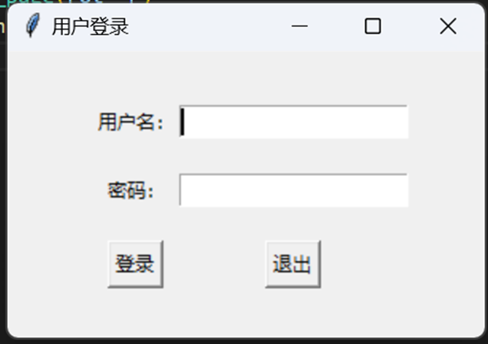

                                                                    图 3 登陆界面

     使用管理员账号登录后可使用用户管理功能，用户管理界面包含增删改查等基础功能。如下图。

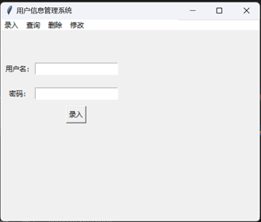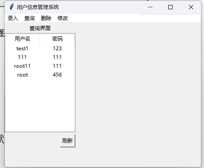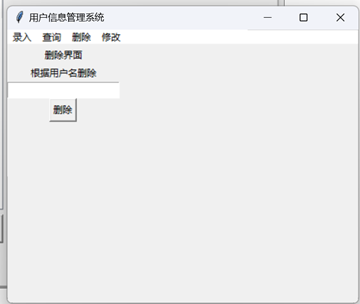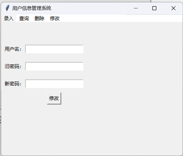

                                                图 4 用户管理界面的增删改查

  使用用户账号登录则进入学生自助学习系统页面，如下图5。

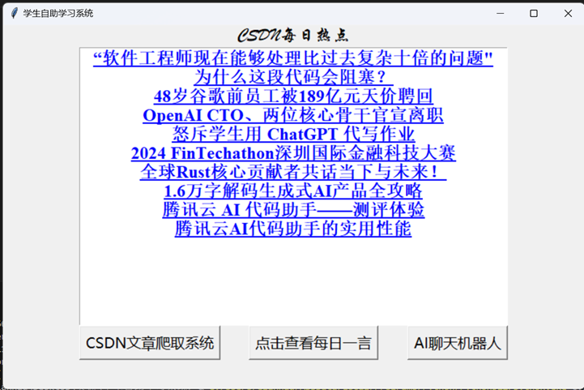

                                                    图 5 学生自助学习系统

    学生自助学习系统的主页展示了实时CSDN时讯热点，用鼠标点击上面的蓝色新闻标题即可跳转到新闻详情页，如下图6。

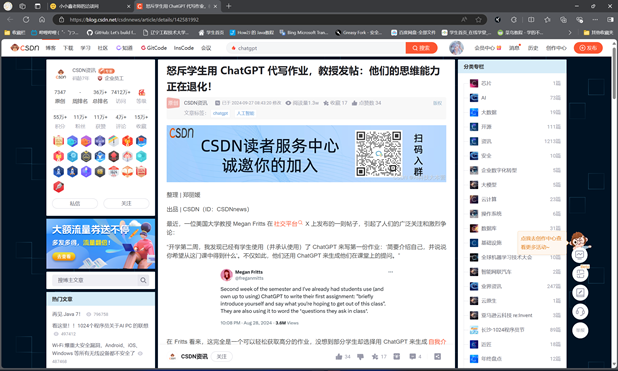

                图 6 点击跳转后的“怒斥学生用 ChatGPT 代写作业…”的新闻详情页

      学生自助学习系统的主页在下方从左到右分别是CSDN文章爬取系统、点击查看每日一言、AI聊天机器人三个按钮，分别对应相应的功能，这里后面会讲。

      在点击‘CSDN文章爬取系统’按钮之后会进入CSDN文章爬取系统，整个系统页面如下图7。在‘请在下框输入要解析的网址’下面的文本框里输入要解析的CSDN文章网址，CSDN文章爬取系统会根据输入的网址下载相应的文章，并去除网页中除文章外的所有碍眼元素，返回出一篇PDF格式的文章内容。PDF版的文章一旦生成就会自动使用系统默认的PDF阅读器，为用户节省了时间，提高了浏览效率。PDF预览界面如图8。

PS.这里的文章保存路径在./data/pdf/文章名字.pdf

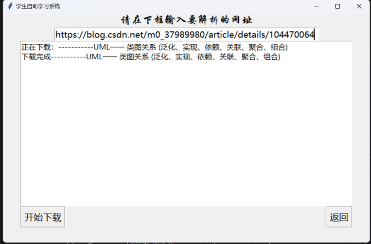

                                                    图 7 CSDN文章爬取系统页面

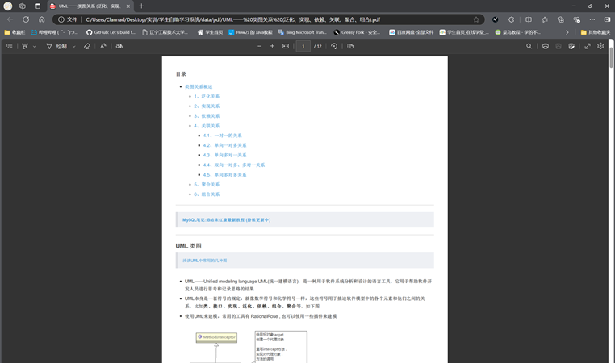

                                                    图 8 生成的PDF文章预览界面

    在主页面点击‘点击查看每日一言’按钮会返回每日一言，但是可以多次点击，几乎没有重复的每日一言。效果如图9。

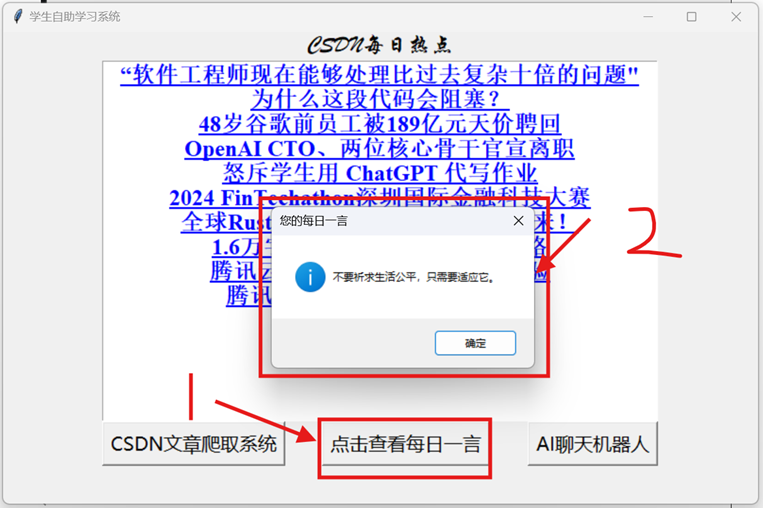

                                                            图 9 每日一言界面

     在点击主页的‘AI聊天机器人’按钮之后系统会自动使用streamlit库在本地52025端口起一个网页（‘小小鑫老师的洽谈间’），经过训练的AI老师小小鑫会和用户进行文本对话，回答用户提出的问题，为用户解决学习生活中的困难或者烦恼。界面如下图10、图11。

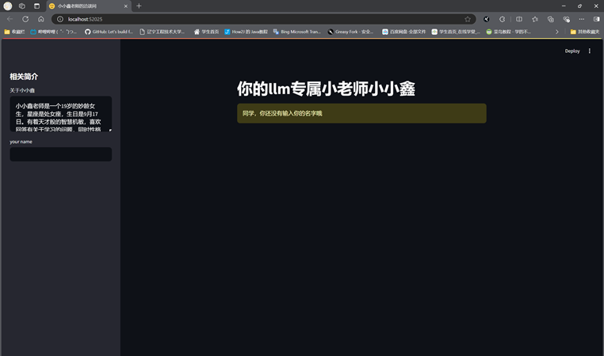

                                                            图 10 进入AI聊天机器人界面

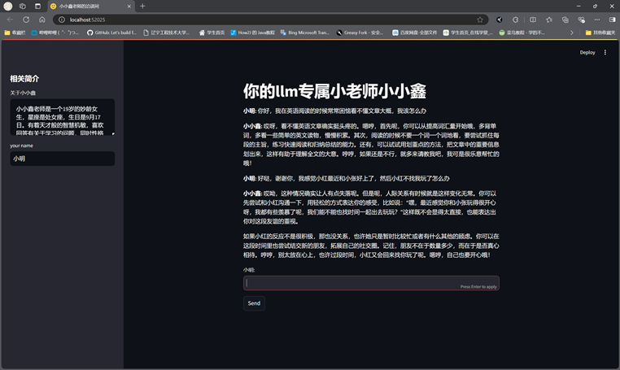

                                                            图 11 用户和AI对话实例

以上是我完成的所有学生自助学习系统的功能。

# 结束语

感谢您的观看。如果有任何建议请联系18671352477@163.com。
